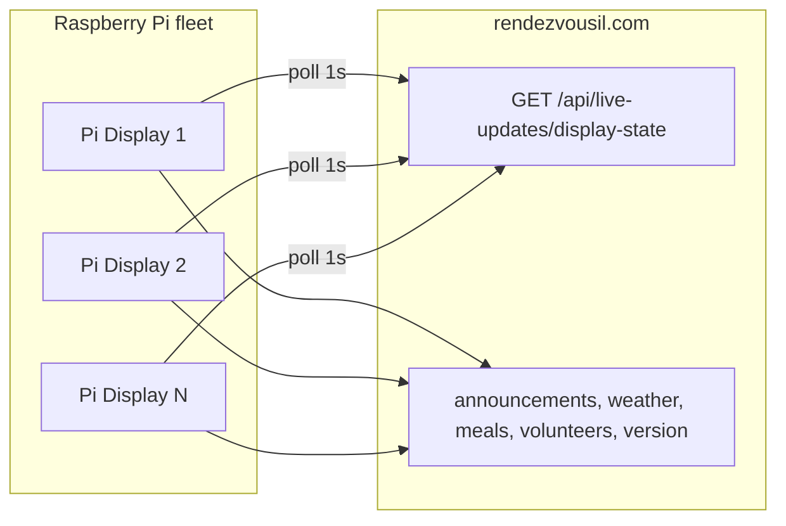

# Roadmap: Android App + Raspberry Pi Live Updates

Two parallel tracks for **rendezvous-il** — an Android companion matching the iOS app, and a fleet of Raspberry Pis running **Live Updates** in sync across the venue.

---

## Part A — Android app (iOS parity)

### Goal

Ship **Rendezvous IL for Android** with the same public, family, and admin capabilities as `ios/RendezvousIL`, reusing existing Next.js APIs and Clerk auth.

### Recommended stack

| Layer | Choice | Why |
|-------|--------|-----|
| UI | **Kotlin + Jetpack Compose** | Closest to SwiftUI; single codebase for phones/tablets |
| Navigation | Compose Navigation (bottom tabs) | Matches iOS 4-tab shell |
| Auth | **Clerk Android SDK** | Same users/roles as web + iOS |
| HTTP | Ktor or Retrofit + OkHttp | Bearer JWT from Clerk session |
| Local reminders | **AlarmManager** + notification channels | Event reminder offsets (5/15/30/60 min) |
| Push | **FCM** | Android equivalent of APNs broadcasts |
| Widgets | **Glance** (App Widgets) | Now/next + next event |
| Offline schedule | Asset `schedule-fallback.json` | Same file iOS ships (generate from `lib/schedule-data.ts`) |
| Shared logic | Port `ios/Shared/ScheduleShared.swift` → Kotlin module | Now/next, meal matching, America/Chicago |

**Repo layout (proposed):**

```
android/
  app/                 # Compose UI, navigation, ViewModels
  core/
    network/           # APIClient, DTOs mirroring ios/APIClient.swift
    schedule/          # Port of ScheduleShared + fallback JSON
    auth/              # AppSession equivalent
  README.md
```

### iOS feature parity matrix

| Feature | iOS | Android phase | Backend change |
|---------|-----|---------------|----------------|
| Home, FAQ, About, Bible Bowl | ✓ | 1 | None |
| Schedule + day picker + meals/volunteers | ✓ | 1 | None |
| Updates (now/next, weather, announcements) | ✓ | 1 | None |
| Cost calculator | ✓ | 1 | None |
| Schedule offline fallback | ✓ | 1 | None |
| Clerk sign-in | ✓ | 2 ✅ | None |
| Family directory browse | ✓ | 2 ✅ | None |
| Directory photo upload | ✓ | 2 ✅ | None |
| Account hub + web deep links | ✓ | 2 ✅ | None |
| Activity ping (`platform: android`) | ✓ | 2 ✅ | Already supported |
| Local event reminders | ✓ | 3 | None |
| FCM push (organizer broadcasts) | APNs | 3 | ✅ FCM token table + register API + FCM sender |
| Home screen widgets | ✓ | 3 | None |
| Admin dashboard | ✓ | 4 | None |
| Staff check-in | ✓ | 4 | None (+ optional QR via CameraX) |
| Admin user management | ✓ | 4 | None |
| Live Activity / Dynamic Island | ✓ | 5 (substitute) | Ongoing notification during event week |
| Lock screen widgets | ✓ | 5 | Optional |

### Phase 1 — Public core (4–6 weeks) ✅

Implemented in `android/` — see `android/README.md`.

**Deliverables**

- Android Studio project, CI build (`.github/workflows/android-build.yml`)
- 4 tabs: Home, Schedule, Updates, More
- All **unauthenticated** screens and API wiring
- Brand theme (lake teal + coral from web tokens)
- `schedule-fallback.json` in assets; `scripts/sync-schedule-fallback.sh`
- User-Agent: `RendezvousIL-Android/1.0`
- Modules: `:app`, `:core:network`, `:core:schedule` (ScheduleShared + CostCalculator port)

**Exit criteria**

- Schedule/updates match iOS behavior on same APIs
- Calculator returns same totals as web for sample inputs
- Works offline for schedule after first load (bundled JSON fallback)

### Phase 2 — Auth + family (3–4 weeks) ✅

Implemented in `android/` — Clerk sign-in, `AppSession`, family directory browse/photo manage, Account screen, and More tab Account section.

**Deliverables**

- Clerk Android SDK (publishable key in `local.properties` / BuildConfig)
- `AppSession` equivalent: `isSignedIn`, admin flags from `GET /api/admin/me`
- Directory browse + photo manage (multipart upload)
- Account screen: sign-in/out, links to `/account`, `/account/settings`, forgot password
- `POST /api/auth/activity` with `platform: "android"` on sign-in, foreground, every 5 min

**Exit criteria**

- Same Clerk user can sign in on iOS, Android, and web
- Directory photo uploaded on Android appears on web directory

### Phase 3 — Notifications + widgets (3–4 weeks) ✅

**Deliverables**

- Local event reminders (offsets: at start, 5, 15, 30, 60 min) + bell on Schedule events
- **FCM:** register/unregister on app launch when broadcast alerts enabled
- Glance widgets: “Next event” + “Now & next” (`:widgets` module)
- Deep link `rendezvousil://schedule` (intent filter → Schedule tab)
- More → **Notifications & widgets** settings screen

**Backend (Phase 3 prerequisite)** ✅

- `android_device_tokens` table in `scripts/schema-turso.sql`
- `POST /api/push/register` accepts `platform: "android"` (iOS default unchanged)
- Admin broadcast sender uses FCM HTTP v1 for Android tokens (parallel to APNs) — see [FCM_SETUP.md](./FCM_SETUP.md)

**Android app** — see `android/README.md` (Firebase `google-services.json`, widget install, reminder permissions)

**Exit criteria**

- Test push from admin reaches Android device (requires FCM env + Firebase project)
- Widget updates when schedule snapshot refreshes

### Phase 4 — Staff + admin (4–6 weeks) ✅

**Deliverables**

- Admin dashboard (`GET /api/admin/mobile/dashboard`)
- Staff check-in flow (lookup, search, submit, undo) — **bonus:** CameraX QR scan
- User management CRUD (mirror `AdminUsersView.swift` / `/admin/users`)
- Role gating: `canViewDashboard`, `canCheckIn`, `canManageUsers`

**Android status (Jun 2026):** Shipped — admin dashboard, staff check-in (with CameraX QR scan), user management CRUD, and role-gated More tab admin section.

**Exit criteria**

- Check-in staff can run full flow on Android without opening web ✅
- Full admin can create/ban/reset password from Android ✅

### Phase 5 — Polish + release (2–3 weeks)

**Deliverables**

- Event-week **ongoing notification** (Live Activity substitute): now/next in persistent notification
- Play Store internal testing track
- Crash reporting (Firebase Crashlytics optional)
- Parity QA checklist vs iOS build

**Total estimate:** ~16–23 weeks one developer; Phases 1–2 can ship a public beta early.

---

## Part B — Raspberry Pi Live Updates fleet

### Goal

Run **venue display boards** on Raspberry Pis showing the same content as [rendezvousil.com/live-updates](https://rendezvousil.com/live-updates), with **multiple Pis switching views at the same time** and reliable **Central Time** for “now / up next.”

### Current architecture (web)

- Route: `/live-updates` → `LiveUpdatesShell`
- **Schedule:** bundled static data (`lib/schedule-data.ts`) — recomputed every minute locally
- **Dynamic data:** HTTP polling only (no WebSockets)
  - Announcements 60s, weather 5m, meals 2m, volunteers 60s, version 30s
- **Auto-rotate:** each browser rotates views every **15s independently** (not synced across devices)
- **Clock:** `getCentralTime()` returns `new Date()` — **assumes device timezone is America/Chicago**

**Gap for multi-Pi:** Pis loaded at different times show different views; wrong TZ breaks schedule transitions.

### Target architecture



**Server-authoritative rotation:** all Pis read `currentView` + `nextRotateAt` from one API derived from **server clock in America/Chicago**.

### Phase Pi-0 — Prerequisites (1 week, web) ✅

| Task | File(s) | Status |
|------|---------|--------|
| Fix Central Time helper | `lib/live-updates/time.ts`, `lib/live-updates/chicago-time.ts` | Done |
| Display coordinator API | `app/api/live-updates/display-state/route.ts` | Done |
| Shell uses coordinator | `components/live-updates/live-updates-shell.tsx` — `?sync=1&kiosk=1` | Done |
| Shared rotation logic | `lib/live-updates/display-state.ts` | Done |

**Pi URL:** `https://rendezvousil.com/live-updates?sync=1&kiosk=1`

### Phase Pi-1 — Browser kiosk (1 week, ops) ✅

Scripts in `scripts/pi/` — see `scripts/pi/README.md`.

**Display-state algorithm (example):**

```ts
const ROTATE_MS = 15_000
const epoch = eventWeekStart.getTime() // e.g. 2027-05-03T00:00:00-05:00
const elapsed = serverNow - epoch
const viewIndex = Math.floor(elapsed / ROTATE_MS) % views.length
const nextRotateAt = epoch + (Math.floor(elapsed / ROTATE_MS) + 1) * ROTATE_MS
```

**Query param for Pis:** `https://rendezvousil.com/live-updates?sync=1&kiosk=1`

- `sync=1` — server-driven view index
- `kiosk=1` — hide footer controls, force fullscreen attempt, disable local auto-rotate toggle
- `view=<name>` — optional fixed view per Pi (cafeteria = meal, lobby = schedule, rooms = photoshow)

**Deliverables in repo:**

```
scripts/pi/
  README.md                 # SD card setup, WiFi, SSH, fixed view, verify
  install-kiosk.sh          # packages, NTP, blanking, autostart, linger
  rendezvous-kiosk.service  # systemd user unit (graphical-session.target)
  chromium-kiosk.sh         # launch flags, VIEW env, env file sourcing
  wait-for-display.sh       # Wayland/X11 socket wait (Bookworm)
  verify-kiosk.sh           # post-install health checks
  set-timezone.sh           # America/Chicago
  env.example               # LOCAL_URL, KIOSK_URL, VIEW
```

**Per-Pi provisioning checklist**

1. Flash **Raspberry Pi OS Desktop** (64-bit) — recommended for Bookworm kiosk
2. Set hostname: `rendezvous-lu-01`, `rendezvous-lu-02`, …
3. Enable **desktop autologin** (`raspi-config` → Boot / Auto Login → Desktop)
4. **NTP:** enable `systemd-timesyncd` — all Pis must agree within ~100ms
5. **Timezone:** `America/Chicago` (backup; server time is source of truth after Pi-0)
6. Run `./install-kiosk.sh` — Chromium kiosk at `/live-updates?sync=1&kiosk=1`
7. Optional: `VIEW=meal` in env or `&view=meal` in URL for dedicated screens

**Exit criteria**

- Two Pis side-by-side switch views within 1s of each other
- Announcement posted in admin appears on all boards within 60s (or lower poll after Pi-2)

### Phase Pi-2 — Fleet hardening (2 weeks) ✅

| Task | Purpose | Status |
|------|---------|--------|
| Lower announcement poll when `kiosk=1` | 20s poll (was 60s) | Done |
| Health ping | `POST /api/live-updates/heartbeat` with `{ deviceId, hostname, ip, lastView }` | Done |
| Admin “displays” page | `/admin/displays` — list Pis, last seen, current view | Done |
| Watchdog | systemd `Restart=always` + user timer every 2m (`kiosk-watchdog.sh`) | Done |
| Offline banner | “Connection lost” banner + `lu_offline_snapshot` in sessionStorage | Done |

**Deliverables:**

- `lib/live-updates/display-heartbeat.ts` — `live_updates_displays` table, upsert heartbeat, stale helper
- `lib/live-updates/kiosk-heartbeat.ts` — device id from URL, heartbeat POST, offline snapshot
- `POST /api/live-updates/heartbeat` — public kiosk ping (no auth)
- `GET /api/admin/displays` — admin/editor/viewer fleet list with `stale` / `status`
- `/admin/displays` — table UI, 30s auto-refresh, nav link under Communication
- `scripts/pi/kiosk-watchdog.sh` + systemd timer; `DEVICE_ID` in env + `?device=` URL param
- `scripts/schema-turso.sql` — `live_updates_displays` table

### Phase Pi-3 — Native Pi client (optional, 3–4 weeks)

Use if Chromium is too heavy or you want HDMI CEC / GPIO control.

**Options**

| Approach | Pros | Cons |
|----------|------|------|
| **Chromium kiosk (recommended)** | Zero UI duplication; deploy = web deploy | RAM ~300MB+, needs desktop |
| **Electron / WebView wrapper** | Fullscreen, auto-restart, inject sync | Still Chromium |
| **Python + PyQt WebEngine** | Lightweight fleet script | Same engine underneath |
| **Fully native (LVGL / pygame)** | Minimal RAM | Rebuild all LU views |

**Recommended:** stay on **Chromium kiosk** until Pi-2 proves insufficient; only then build a thin **Electron** or **WPE WebKit** launcher that loads the same URL.

### Phase Pi-4 — Sub-second sync (optional)

- **SSE** `/api/live-updates/stream` — push view changes + urgent announcements
- **PTP** on local VLAN — only if NTP isn’t enough (rare for 15s rotation)
- **Dedicated “master” Pi** — not recommended; server coordinator is simpler

### Hardware notes

| Item | Recommendation |
|------|----------------|
| Board | Pi 4 (2GB+) or Pi 5 for smoother Chromium |
| Storage | 16GB+ SD or USB SSD (SSD preferred) |
| Display | HDMI TV/monitor; set overscan in `config.txt` if needed |
| Network | Venue WiFi; static DHCP reservation per Pi |
| Power | UPS on router + Pis if brief outages expected |

### Multi-Pi deployment scenarios

| Scenario | Setup |
|----------|--------|
| **Identical rotating boards** | All Pis → `?sync=1&kiosk=1` (same view at same time) |
| **Dedicated content** | Pi A `?view=schedule`, Pi B `?view=meal`, Pi C `?view=announcements` (no rotate) |
| **Mixed** | Lobby rotates; cafeteria fixed on meal view |

---

## Suggested execution order

| Order | Track | Why |
|-------|-------|-----|
| 1 | **Pi-0** (web sync API) | Unblocks venue hardware before event |
| 2 | **Pi-1** (kiosk scripts) | Cheap to validate on 2 Pis at home |
| 3 | **Android Phase 1** | Public app beta independent of Pi |
| 4 | **Pi-2** (fleet admin) | Ops visibility before event week |
| 5 | **Android Phase 2–4** | Auth + staff features before 2027 registration push |
| 6 | **Android Phase 3 + 5** | Push + widgets + store release |

---

## Open decisions (need your input)

1. **Android package name:** `com.rendezvousil.app` (match iOS)?
2. **Play Store:** organization account vs internal APK sideload for staff only?
3. **Pi count + placement:** how many boards, which views per location?
4. **Dedicated displays:** rotate all together, or fixed views per room?
5. **Push on Android:** FCM in Firebase project under braddcorp / rendezvousil?

---

## Related docs

- iOS app: [ios/README.md](../ios/README.md)
- Admin users + activity tracking: [README.md](../README.md) (Family accounts section)
- Live updates UI: `components/live-updates/`, `lib/live-updates/`
